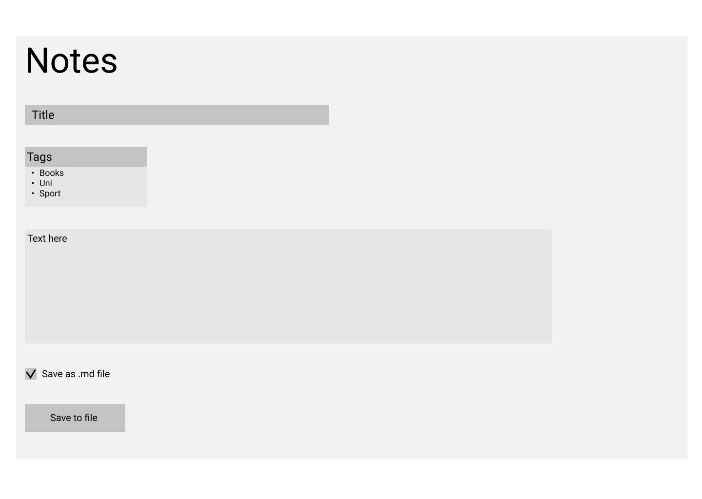
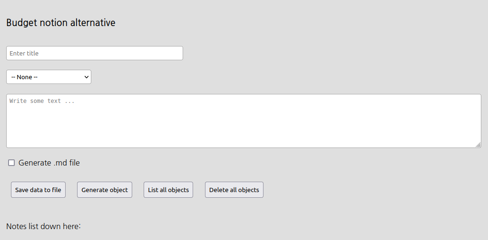
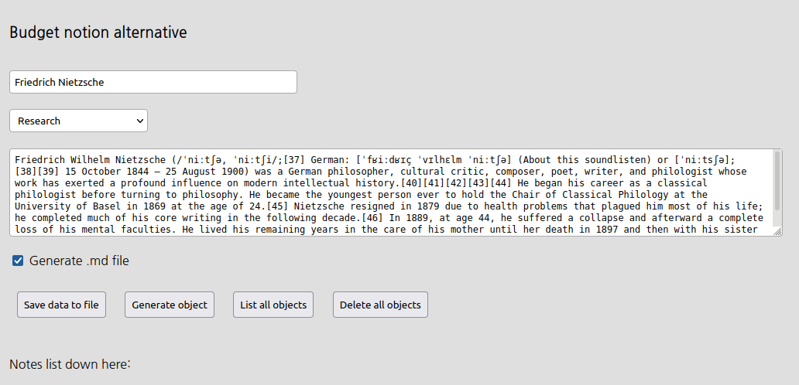
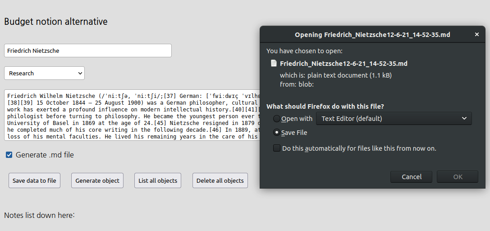
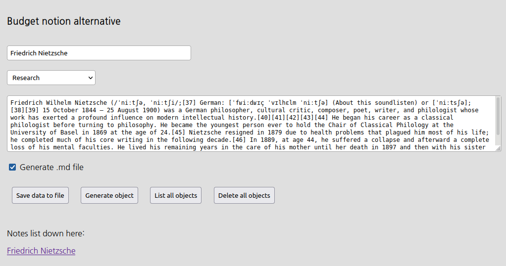

# Общая информация

- Предмет: Web-технологии разработки прикладных программных систем
- Тема лабораторной работы: создание сервиса для ведения заметок
- Студент: Олейников И. А.
- Группа: М8О-111М-20

## Техническое задание

- Создание заголовка заметки
- Генерация уникального названия файла при скачивании
- Возможность указание тегов для заметки
- Возможность скачивать заметку в нескольких форматах
  - А именно в `.txt` и `.md`
- Автоматическая генерация структуры файла
- Возможность сохранения заметки на стороне сервиса
- Возможность удаления всех заметок, сохраненных на стороне сервиса
- Возможность просмотра всех заметок, сохраненных на стороне сервиса

## Референс и макет

Основным референсом для этой работы стал сервис https://keep.google.com/

Так выглядит макет, который получился при разработке интерфейса:



## Описание логики работы сервиса

После заполнения формы заметки, которая включает в себя следующие пункты:

- Название заметки
- Указание тега заметки
- Текст заметки
- Флаг генерации `.md` файла

Полученную заметку можно сохранить локально на свой компьютер путем нажатия кнопки `Save data to file`. Можно сохранить заметку на стороне сервиса путем нажатия кнопки `Generate object`. Есть возможность просмотреть все заметки, сохраненные на стороне сервиса или удалить их путем нажатия на кнопки `List all objects` и `Delete all objects` соответственно. При сохранении заметки на сервисе ниже надписи будут выведены названия этих заметок. 

## Скриншоты

Начальные вид страницы:



Написание текста:



Диалог сохранения заметки в `.md` формате:



Результат сохранения заметки на сервисе:



## Вид сгенерированной заметки

Для заметки сохраненной в `.md`

```markdown
# Что такое анализ ? 14/5/21 @ 14:45:47
> Tags: Research

Анализ - понижение уровня абстракции
```

Для заметки сохраненной в `.txt`

```
Title: Что такое анализ ?
Date: 14/5/21 @ 14:49:46
Tags: Research
Анализ - понижение уровня абстракции
```

## Код

Весь код представлен ниже, также его можно найти в файлах [index.html](../code/index.html) и [script.js](../code/script.js) 

### `index.html`

```html
<!DOCTYPE html>
<html>

<head>
	<link rel="preconnect" href="https://fonts.gstatic.com">
	<link href="https://fonts.googleapis.com/css2?family=Nanum+Gothic&display=swap" rel="stylesheet">
	<meta content="text/html;charset=utf-8" http-equiv="Content-Type">
	<meta content="utf-8" http-equiv="encoding">
	<title>Notes</title>
	<style>
		body {
			font-family: 'Nanum Gothic', sans-serif;
		}

		div {
			padding: 10px;
			background-color: #dfdfdf;
			overflow: hidden;
		}

		input[type=text],
		textarea,
		select {
			font: 17px;
			width: 55%;
			padding: 6px;
			border: 1px solid rgb(170, 170, 170);
			border-radius: 4px;
		}

		input[type=button] {
			font: 17px;
			width: auto;
			float: left;
			cursor: pointer;
			padding: 7px;
		}

		[id=selectTag] {
			width: 10%;
		}

		input[id=txtName] {
			width: 20%;
		}

		.btns div {
			display: inline-block;
		}
	</style>

</head>

<body>


	<div>
		<div>
			<h3>Budget notion alternative</h3>
		</div>
		<div>
			<input type="text" id="txtName" placeholder="Enter title" />
		</div>
		<div>
			<select id="selectTag">
				<option selected value="">-- None --</option>
				<option value="University">University</option>
				<option value="Sport">Sport</option>
				<option value="Books">Books</option>
				<option value="Invest">Invest</option>
				<option value="Research">Research</option>
			</select>
		</div>
		<div>
			<textarea id="msg" name="msg" placeholder="Write some text ..." style="height:100px"></textarea>
		</div>
		<div>
			<input type="checkbox" id="check" value="Generate .md file" />
			<label for='check'> Generate .md file</label>
		</div>
		<div class="btns">
			<div>
				<input type="button" id="bt" value="Save data to file" />
			</div>
			<div>
				<input type="button" id="btObj" value="Generate object" />
			</div>
			<div>
				<input type="button" id="btListObj" value="List all objects" />
			</div>
			<div>
				<input type="button" id="btDeleteAll" value="Delete all objects" />
			</div>
		</div>
		<div>
			<p>Notes list down here: </p>
			<p id="firstP"></p>
		</div>

	</div>

	<script type='text/javascript' src='script.js'></script>

</html>
```

### `script.js`

```javascript
function getDdate() {
	const today = new Date();
	var date = today.getDate() + '/' + (today.getMonth() + 1) + '/' + today.getFullYear().toString().substr(-2);
	var time = today.getHours() + ':' + today.getMinutes() + ':' + today.getSeconds();
	return date + '_' + time;
}

function createFileName(name, isMd) {
	var today = new Date();
	var ext = 'txt'
	if (isMd === true) {
		ext = 'md'
	}
	dateTime = getDdate().replaceAll('/', '-').replaceAll(':', '-')
	return name.replaceAll(' ', '_') + dateTime + '.' + ext
}

function createFileBody(arr, isMd) {
	quoteLine = '> Tags: '
	let [title, tag, text] = arr;
	if (isMd === true) {
		title = '# '.concat(title + ' ', getDdate().replace('_', ' @ '), '\n')
		tag = quoteLine.concat(tag, '\n'.repeat(2))
	} else {
		title = 'Title: ' + title + '\n' + 'Date: ' + getDdate().replace('_', ' @ ') + '\n'
		tag = 'Tags: ' + tag + '\n'
	}
	return ''.concat(title, tag, text)
}

function saveTextAsFile() {
	var name = document.getElementById('txtName').value;
	var country = document.getElementById('selectTag').value;
	var msg = document.getElementById('msg').value;
	var isMd = document.getElementById('check').checked;
	var textToWrite = createFileBody([name, country, msg], isMd);

	var textFileAsBlob = new Blob([textToWrite], {
		type: 'text/plain'
	});
	var fileNameToSaveAs = createFileName(name, isMd);

	var downloadLink = document.createElement("a");
	downloadLink.download = fileNameToSaveAs;
	downloadLink.innerHTML = "Download File";
	if (window.webkitURL != null) {
		downloadLink.href = window.webkitURL.createObjectURL(textFileAsBlob);
	} else {
		downloadLink.href = window.URL.createObjectURL(textFileAsBlob);
		downloadLink.onclick = destroyClickedElement;
		downloadLink.style.display = "none";
		document.body.appendChild(downloadLink);
	}
	downloadLink.click();
}

function getObject() {
	var obj = {
		name: undefined,
		tag: undefined,
		text: undefined
	}
	var name = document.getElementById('txtName').value;
	var country = document.getElementById('selectTag').value;
	var msg = document.getElementById('msg').value;
	var isMd = document.getElementById('check').checked; 

	obj.name = name;
	obj.tag = country;
	obj.text = msg;

	console.log(obj)

	var today = new Date();
	localStorage.setItem('obj' + today, JSON.stringify(obj));

	var newP = document.createElement("a");
	newP.className = 'dynoName';
	var linkText = document.createTextNode(obj.name + '\t');
	newP.appendChild(linkText);
	newP.href = 'http://google.com'
	document.getElementById("firstP").appendChild(newP);
}

function allStorage() {

	var values = [],
		keys = Object.keys(localStorage),
		i = keys.length;

	while (i--) {
		values.push(localStorage.getItem(keys[i]));
	}
	console.log(values)
	return values;
}

function deleteAllObjects() {
	localStorage.clear();
	var paras = document.getElementsByClassName('dynoName');
	while (paras[0]) {
		paras[0].parentNode.removeChild(paras[0]);
	}
}

var button = document.getElementById('bt');
button.addEventListener('click', saveTextAsFile);

var button = document.getElementById('btObj');
button.addEventListener('click', getObject);

var button = document.getElementById('btListObj');
button.addEventListener('click', allStorage);

var button = document.getElementById('btDeleteAll');
button.addEventListener('click', deleteAllObjects);
```

