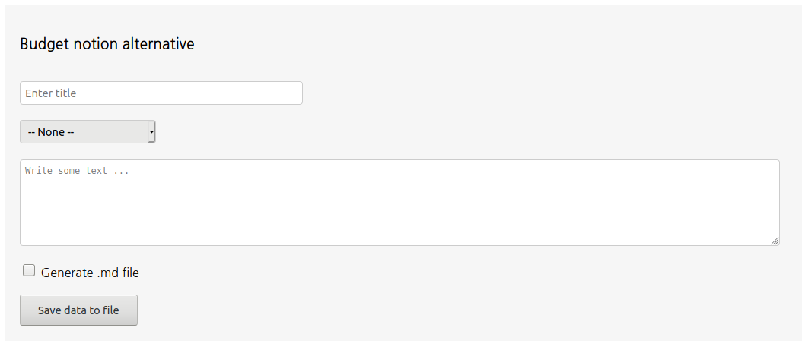
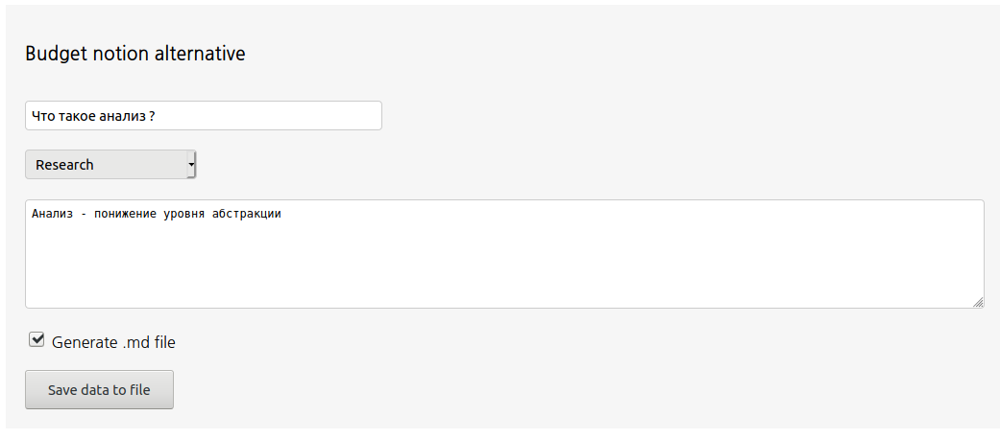
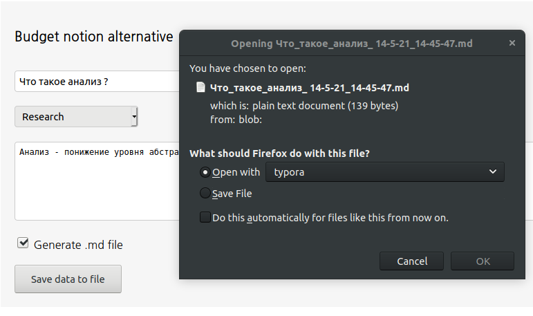

# Отчет

В итоге сервис получился очень похожим на макет из фигмы. Весь функционал реализован

## Скриншоты

Начальные вид страницы



Написание текста



Диалог сохранения заметки в `.md` формате



## Вид заметки

Для заметки сохраненной в `.md`

```markdown
# Что такое анализ ? 14/5/21 @ 14:45:47
> Tags: Research

Анализ - понижение уровня абстракции
```

Для заметки сохраненной в `.txt`

```
Title: Что такое анализ ?
Date: 14/5/21 @ 14:49:46
Tags: Research
Анализ - понижение уровня абстракции
```

## Код

Весь код можно найти в файлах [index.html](../code/index.html) и [script.js](../code/script.js) 

