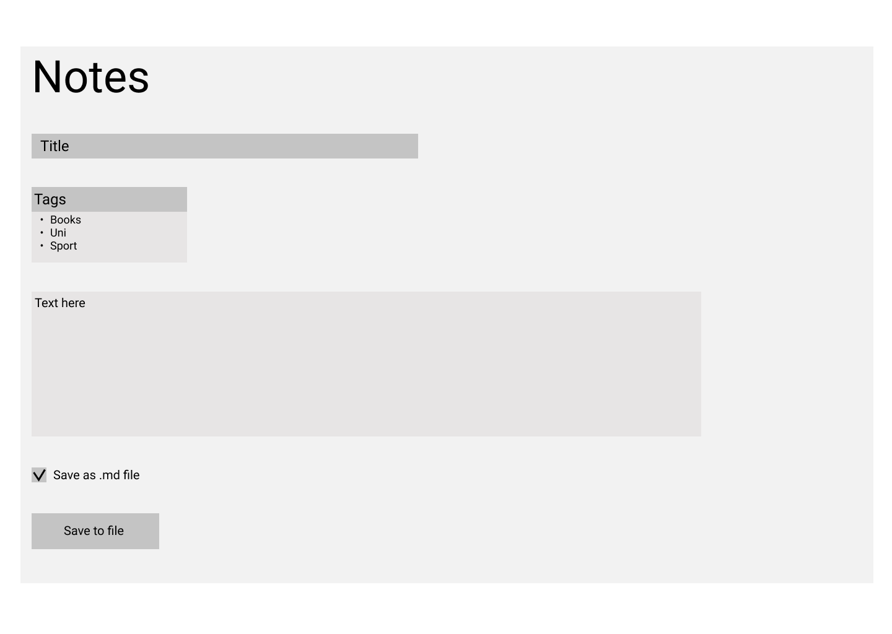

# Техническое задание

Сервис для написания и сохранения заметок

## Необходимый функционал

- Создание заголовка заметки
- Генерация уникального названия файла при скачивании
- Возможность указание тегов для заметки
- Возможность скачивать заметку в нескольких форматах
  - А именно в `.txt` и `.md`
- Автоматическая генерация структуры файла
- Минималистичный дизайн

## Макет сервиса

## Референс

- https://keep.google.com/

